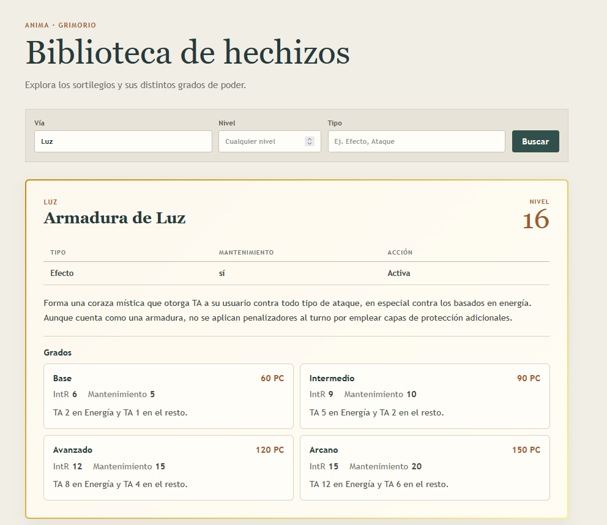
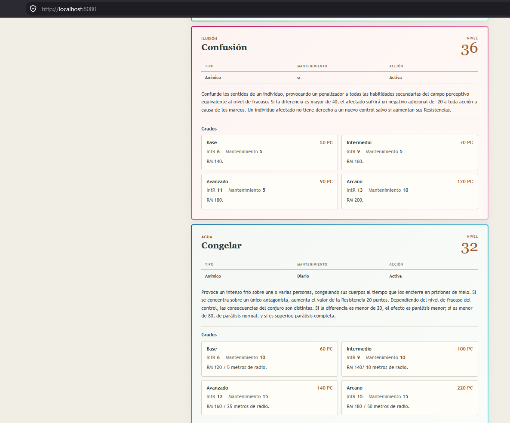

# Anima-magic-docker-example
Example of a full stack app to see magic spells from the TTRPG Anima Beyond Fantasy using Docker.

## Stack
### db
MongoDB

### Api
Node.js with express

### Front end
Vue.js

## Purpose
The purpose of this proyect is to learn Docker with a full stack app.

## Imagenes

---

